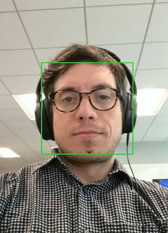
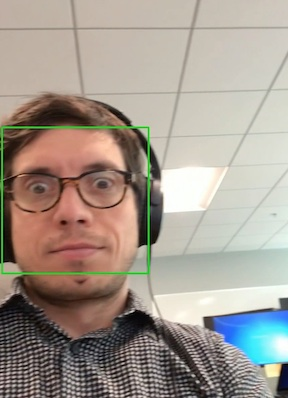

Small projects accumulated over time.

# Face Detector

Captures video and detected a face using Haar cascade face detector. \

# FastAPI

From the course on Educative.io "Build a REST API Using Python and Deploy it on Microsoft Azure".

# PDF Combiner

Combines several PDFs into one. 

# Subtitle Player

Reads a movie subtitle file and displays text on a screen (before I found an off-the-shelf one 
[FreeSubtitlePlayer](https://sourceforge.net/projects/freesubtitleplayer/).

Make sure subtitles are saved in UTF-8 format in order to avoid weird characters. The conversion can be done online too.
